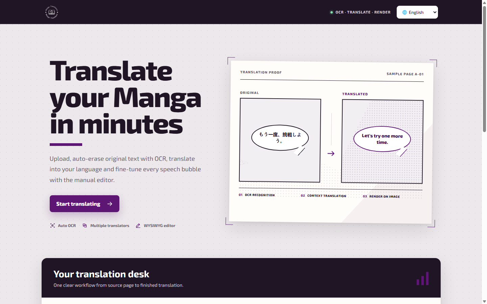
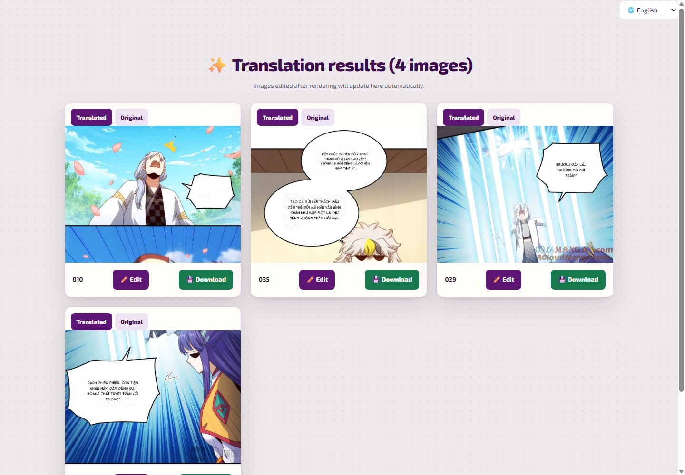
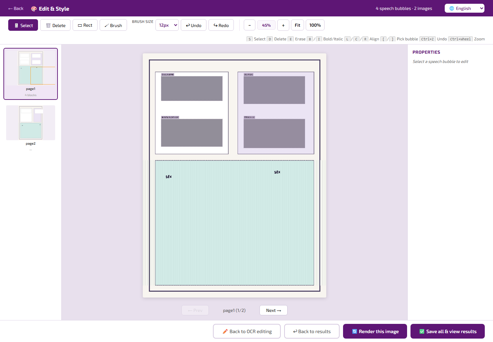
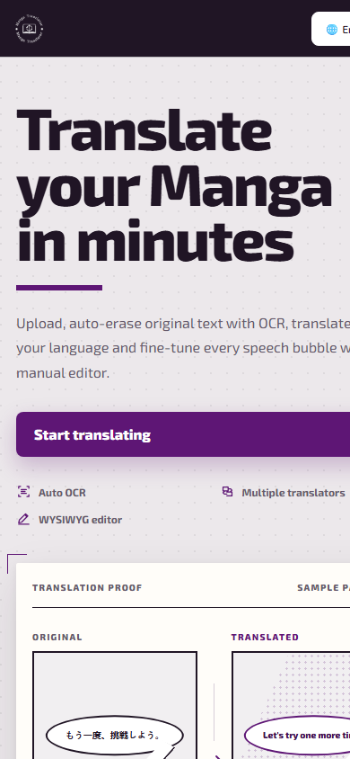

# Manga Translator

> ⚡ Translate manga / manhwa / manhua — OCR, translate, erase and re-letter in one tool.

**Manga Translator** turns raw manga/comic pages into readable translated images. It recognizes text with **OCR**, **translates** it, **erases** the original text, and **renders** clean, re-lettered text — optional WYSIWYG manual editing for speech bubbles.



## ✨ Features

- 🔍 **Auto OCR** (Chrome Lens) — detects text blocks and speech bubbles
- 🌐 **Multi-translator** — Gemini, Local LLM (OpenAI-compatible), Google
- 🎨 **WYSIWYG editor** — fix speech bubbles, erase, restyle (font / size / color / weight / align)
- 🖼️ **Batch upload** — JPG, JPEG, PNG, WebP, BMP, TIFF, AVIF
- 🌍 **10+ target languages** + multilingual UI (Vietnamese / English, auto-detected)
- 🔑 **Gemini multi-key** — rotates keys on quota / auth errors
- 📦 **Download** single images or all as ZIP

## 🚀 Quick Start (Windows)

> Recommended: Python **3.10** or **3.11**. The project creates its own `.venv` so it never touches your global Python.

```powershell
powershell -ExecutionPolicy Bypass -File .\setup_venv.ps1
powershell -ExecutionPolicy Bypass -File .\run_app.ps1
```

Then open **http://127.0.0.1:5000** in your browser.

If you have multiple Python versions, pick one:

```powershell
powershell -ExecutionPolicy Bypass -File .\setup_venv.ps1 -PythonVersion 3.10
```

After `.venv` is created, just run `run_app.ps1` next time.

> 🛠️ **Why `.venv`?** Packages like `opencv-python`, `numpy`, and `pillow` are sensitive to the Python version. A project-local environment keeps dependencies isolated, never breaks your global Python, and is trivial to delete/recreate:
> ```powershell
> Remove-Item -Recurse -Force .\.venv
> powershell -ExecutionPolicy Bypass -File .\setup_venv.ps1
> ```

## 🖥️ Manual Run

**Windows:**

```powershell
py -3.10 -m venv .venv
.\venv\Scripts\python.exe -m pip install --upgrade pip
.\venv\Scripts\python.exe -m pip install -r requirements.txt
.\venv\Scripts\python.exe app.py
```

**macOS / Linux:**

```bash
python3.10 -m venv .venv
./.venv/bin/python -m pip install --upgrade pip
./.venv/bin/python -m pip install -r requirements.txt
./.venv/bin/python app.py
```

## 🎬 How It Works

1. **Upload** one or more images (choose source + target language).
2. **OCR** reads the text bubbles.
3. **Translate** with your engine (Gemini / Local LLM / Google).
4. **Erase & render** — original text removed, translated text drawn back in.
5. Optional: fine-tune bubbles in the **editor**, then download.



## 🎨 Manual Editor

Open the editorial workspace after OCR to adjust speech bubbles, erase residual text, and style the lettering — font, size, color, bold/italic, alignment — with live WYSIWYG preview.



Mobile friendly too:



## 🔑 Gemini Multi-Key

Paste multiple keys separated by newline, comma, or semicolon:

```text
key_1
key_2
key_3
```

If a key hits quota / auth / permission errors, the app tries the next key. If all fail, it keeps the original text and shows a warning instead of crashing.

The **Model Name** field (default `gemini-3.1-flash-lite`) is saved in your browser for next time.

## 🤖 Local LLM

Point to any **OpenAI-compatible** `/v1/chat/completions` server:

- LM Studio: `http://localhost:1234`
- Ollama (OpenAI-compatible): `http://localhost:11434`
- LocalAI / vLLM: your server's config

Enter the model name, e.g. `qwen2.5`, `llama3.2`, `mistral`.

## 🌐 Environment Variables

```powershell
$env:HOST="127.0.0.1"
$env:PORT="5000"
$env:FLASK_DEBUG="1"
$env:MAX_UPLOAD_MB="50"
$env:SESSION_TTL_SECONDS="21600"
$env:SECRET_KEY="change-me"
powershell -ExecutionPolicy Bypass -File .\run_app.ps1
```

| Variable | Default | Description |
|---|---|---|
| `HOST` | `127.0.0.1` | Bind address |
| `PORT` | `5000` | HTTP port |
| `FLASK_DEBUG` | `0` | Debug mode |
| `MAX_UPLOAD_MB` | `50` | Max upload size |
| `SESSION_TTL_SECONDS` | `21600` (6h) | Session lifetime |
| `SECRET_KEY` | `secret_key` | Flask secret |

---

## 🇻🇳 Tiếng Việt

> ⚡ Dịch truyện tranh manga / manhwa / manhua — OCR, dịch, xoá và render lại chữ chỉ trong một công cụ.

**Manga Translator** biến các trang truyện gốc thành ảnh dịch dễ đọc. Nó nhận dạng text bằng **OCR**, **dịch** nội dung, **xoá** text gốc, rồi **render** lại chữ mới — kèm trình chỉnh sửa thủ công WYSIWYG cho bóng thoại.


### ✨ Tính năng

- 🔍 **OCR tự động** (Chrome Lens) — nhận dạng bóng thoại và khối text
- 🌐 **Nhiều bộ dịch** — Gemini, Local LLM (tương thích OpenAI), Google
- 🎨 **Chỉnh sửa WYSIWYG** — sửa bóng thoại, xoá nền, đổi style (font / cỡ / màu / đậm / căn lề)
- 🖼️ **Tải lên hàng loạt** — JPG, JPEG, PNG, WebP, BMP, TIFF, AVIF
- 🌍 **10+ ngôn ngữ đích** + giao diện đa ngôn ngữ (Việt / Anh, tự nhận diện)
- 🔑 **Gemini nhiều key** — tự đổi key khi hết quota / lỗi auth
- 📦 **Tải ảnh lẻ** hoặc **toàn bộ ZIP**

### 🚀 Chạy nhanh (Windows)

> Nên dùng Python **3.10** hoặc **3.11**. Project tự tạo `.venv` riêng nên không ảnh hưởng Python toàn máy.

```powershell
powershell -ExecutionPolicy Bypass -File .\setup_venv.ps1
powershell -ExecutionPolicy Bypass -File .\run_app.ps1
```

Mở trình duyệt tại **http://127.0.0.1:5000**.

Nếu máy có nhiều bản Python:

```powershell
powershell -ExecutionPolicy Bypass -File .\setup_venv.ps1 -PythonVersion 3.10
```

> 🛠️ **Vì sao dùng `.venv`?** Các thư viện xử lý ảnh như `opencv-python`, `numpy`, `pillow` nhạy với phiên bản Python. Môi trường riêng giúp cài dependency độc lập, không hỏng Python toàn máy, dễ xóa/khôi phục:
> ```powershell
> Remove-Item -Recurse -Force .\.venv
> powershell -ExecutionPolicy Bypass -File .\setup_venv.ps1
> ```

### 🖥️ Chạy thủ công

**Windows:**

```powershell
py -3.10 -m venv .venv
.\venv\Scripts\python.exe -m pip install --upgrade pip
.\venv\Scripts\python.exe -m pip install -r requirements.txt
.\venv\Scripts\python.exe app.py
```

**macOS / Linux:**

```bash
python3.10 -m venv .venv
./.venv/bin/python -m pip install --upgrade pip
./.venv/bin/python -m pip install -r requirements.txt
./.venv/bin/python app.py
```

### 🎬 Cách hoạt động

1. **Tải lên** một hoặc nhiều ảnh (chọn ngôn ngữ nguồn + đích).
2. **OCR** đọc các bóng thoại.
3. **Dịch** bằng bộ dịch đã chọn (Gemini / Local LLM / Google).
4. **Xoá & render** — xoá text gốc, vẽ lại text đã dịch.
5. Tuỳ chọn: tinh chỉnh bóng thoại trong **trình chỉnh sửa**, rồi tải về.


### 🎨 Trình chỉnh sửa thủ công

Sau bước OCR, mở workspace chỉnh sửa để sửa bóng thoại, xoá text sót, và đổi kiểu chữ — font, cỡ, màu, đậm/nghiêng, căn lề — với preview WYSIWYG trực tiếp.


Thân thiện trên điện thoại:


### 🔑 Gemini nhiều key

Nhập nhiều key cách nhau bằng xuống dòng, dấu phẩy hoặc dấu chấm phẩy:

```text
key_1
key_2
key_3
```

Khi key bị quota / auth / permission lỗi, app tự thử key kế tiếp. Nếu tất cả lỗi, app giữ nguyên text gốc và hiển thị cảnh báo thay vì crash.

Ô **Model Name** (mặc định `gemini-3.1-flash-lite`) được lưu trong trình duyệt cho lần sau.

### 🤖 Local LLM

Trỏ tới server tương thích **OpenAI** `/v1/chat/completions`:

- LM Studio: `http://localhost:1234`
- Ollama (tương thích OpenAI): `http://localhost:11434`
- LocalAI / vLLM: tuỳ cấu hình server

Nhập tên model, ví dụ `qwen2.5`, `llama3.2`, `mistral`.

### 🌐 Biến môi trường

```powershell
$env:HOST="127.0.0.1"
$env:PORT="5000"
$env:FLASK_DEBUG="1"
$env:MAX_UPLOAD_MB="50"
$env:SESSION_TTL_SECONDS="21600"
$env:SECRET_KEY="change-me"
powershell -ExecutionPolicy Bypass -File .\run_app.ps1
```

| Biến | Mặc định | Mô tả |
|---|---|---|
| `HOST` | `127.0.0.1` | Địa chỉ bind |
| `PORT` | `5000` | Cổng HTTP |
| `FLASK_DEBUG` | `0` | Chế độ debug |
| `MAX_UPLOAD_MB` | `50` | Kích thước upload tối đa |
| `SESSION_TTL_SECONDS` | `21600` (6h) | Thời gian sống session |
| `SECRET_KEY` | `secret_key` | Bí mật Flask |
