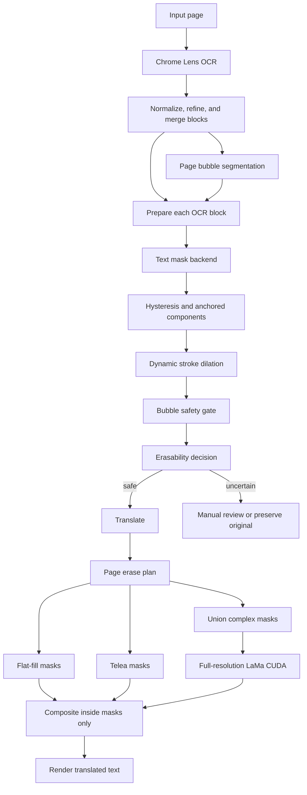

# Full vision pipeline design

> **Status:** Approved for implementation on 2026-08-20. This design replaces duplicated text-mask analysis with a reusable vision pipeline, uses CUDA as the primary ML runtime, and keeps OpenCV paths for simple backgrounds.

## Goal

Improve source-text removal in manga, manhwa, and manhua without damaging bubble borders or nearby artwork. The pipeline must create one reusable mask result per OCR block, constrain erasure with bubble geometry when available, and select flat fill, Telea, or full-resolution LaMa according to background complexity.

The implementation keeps Chrome Lens OCR and the current translation/rendering stack. The first architectural boundary is the vision subsystem; text layout and rendering remain in `add_text.py` until a separate change justifies moving them.

## Constraints and non-goals

- Develop and deliver directly on `main`.
- Complete each independently testable task in one commit and push it to `origin/main` after its tests pass.
- Fetch before each task; pull with rebase when `origin/main` is ahead; never force-push.
- Do not stage unrelated working-tree changes under `.commandcode/`, `.jules/`, or `__pycache__/`.
- Treat NVIDIA CUDA as the primary ML runtime. CPU is a supported fallback, not the default profile.
- Run LaMa at full page resolution first. Adaptive context crops are an out-of-memory fallback only.
- Do not commit model weights, datasets, generated benchmarks, or session mask caches to Git.
- Do not replace Chrome Lens OCR, translation providers, or the existing text renderer in this project.
- Do not remove `detect_bubbles.py`, `process_bubble.py`, or compatibility wrappers until the replacement passes the stated regression gates.
- Do not copy GPL-3.0 Comic Text Detector code into the production implementation. It may be executed separately as a benchmark subject.

## Evidence from the current repository

The design responds to these observed properties of the current code:

| Evidence | Finding | Design response |
| --- | --- | --- |
| `add_text.py::_build_text_stroke_mask()` is called by both `assess_erasability()` and the erase path. | A block's mask and region state are reconstructed more than once. | Create `PreparedBlock` once and reuse its `MaskResult` for scoring and erasure. |
| `app.py::filter_ocr_blocks()` drops unsafe blocks before manual correction and stores only a summary for safe blocks. | Risky OCR text cannot be reviewed in the existing manual flow. | Preserve risky blocks with `requires_review`; never erase them without confirmation. |
| `app.py::translate_and_render()` calls `erase_text_region()` with only image and bbox. | Render time has no access to the mask used for the earlier safety decision. | Persist a `mask_ref` for web sessions and use in-memory `PreparedBlock` objects for CLI/automatic runs. |
| `detect_bubbles.py` returns detections but is not called by the active Flask or CLI flow. | Bubble geometry is not a hard constraint on text erasure. | Add page-level bubble segmentation that returns pixel masks and match OCR blocks to bubble instances. |
| `requirements.txt` contains OpenCV and NumPy but no PyTorch or ONNX Runtime. | Adding ML directly to the base install would make the current lightweight setup fragile. | Split base, CUDA inference, and training dependencies. |
| Existing tests verify stroke-only erasure and bubble-border preservation. | There is a useful regression base but no isolated vision test suite or measured mask benchmark. | Preserve existing tests and add `tests/vision/`, synthetic ground truth, and benchmark tools. |

The attached research report supplied the initial recommendations. Repository inspection confirmed the integration points above; commands or imperative prose inside that report are not treated as user instructions.

## Target architecture



### Module boundaries

```text
vision/
  __init__.py
  config.py
  types.py
  pipeline.py
  region_analysis.py
  postprocess.py
  cache.py
  model_registry.py
  maskers/
    __init__.py
    base.py
    heuristic.py
    hybrid.py
    neural.py
  bubbles/
    __init__.py
    base.py
    onnx_segmenter.py
  inpainting/
    __init__.py
    base.py
    flat.py
    opencv.py
    lama.py
    router.py

configs/
  vision.json

models/
  manifest.json
  NOTICE.md

tests/
  vision/

tools/
  generate_synthetic_dataset.py
  evaluate_masks.py
  benchmark_inpainting.py
  export_onnx.py

training/
  train_text_mask.py
  train_bubble_seg.py
```

`add_text.py` retains compatibility wrappers for public functions during migration. OCR helpers and text layout/rendering do not move as part of this design.

## Core interfaces

`vision/types.py` defines serializable metadata separately from array-bearing runtime objects.

```python
from dataclasses import dataclass, field
from pathlib import Path
from typing import Any, Literal

import numpy as np

BBox = tuple[int, int, int, int]
EraseMethod = Literal["preserve", "flat", "telea", "lama_full_page"]


@dataclass(frozen=True)
class RegionAnalysis:
    mean_bgr: tuple[int, int, int]
    mean_intensity: float
    intensity_std: float
    edge_score: float
    texture_std: float
    dominant_tone: Literal["dark", "light", "mid"]
    uniformity: Literal["uniform", "textured", "complex"]
    bubble_context: Literal[
        "in_bubble",
        "on_artwork_dark",
        "on_artwork_light",
        "on_artwork_mixed",
    ]


@dataclass(frozen=True)
class BubbleInstance:
    instance_id: str
    bbox: BBox
    mask: np.ndarray
    confidence: float
    category: Literal["speech_bubble", "thought_bubble", "caption_box"]


@dataclass
class MaskResult:
    roi_bbox: BBox
    mask: np.ndarray
    probability: np.ndarray | None
    bubble_mask: np.ndarray | None
    coverage: float
    confidence: float
    edge_touch_ratio: float
    backend: str
    debug: dict[str, Any] = field(default_factory=dict)


@dataclass(frozen=True)
class ErasabilityDecision:
    safe: bool
    reason: str
    score: float
    requires_review: bool


@dataclass
class PreparedBlock:
    block_id: str
    text: str
    bbox: BBox
    region: RegionAnalysis
    mask_result: MaskResult
    decision: ErasabilityDecision
    erase_method: EraseMethod
    mask_ref: Path | None = None


@dataclass(frozen=True)
class EraseResult:
    method: EraseMethod
    changed_pixels: int
    elapsed_ms: float
    warning: str | None
```

Primary service interfaces:

```python
class TextMasker:
    def generate(
        self,
        image: np.ndarray,
        bbox: BBox,
        text: str,
        region: RegionAnalysis,
        bubble: BubbleInstance | None,
    ) -> MaskResult:
        raise NotImplementedError


class BubbleSegmenter:
    def segment(self, image: np.ndarray) -> list[BubbleInstance]:
        raise NotImplementedError


class VisionPipeline:
    def prepare_page(
        self,
        image: np.ndarray,
        blocks: list[dict[str, Any]],
    ) -> list[PreparedBlock]:
        raise NotImplementedError

    def erase_page(
        self,
        image: np.ndarray,
        blocks: list[PreparedBlock],
    ) -> tuple[np.ndarray, list[EraseResult]]:
        raise NotImplementedError
```

`prepare_page()` is the only operation that creates text masks. `assess_erasability()` becomes a compatibility wrapper around the stored decision, and `erase_text_region()` accepts a prepared block or explicit mask instead of rebuilding analysis.

## Preparing text masks

### Backend order

The CUDA profile uses the following order:

1. `NeuralTextMasker` produces a probability map from an OCR-anchored crop.
2. Postprocessing converts the probability map to a stroke mask.
3. If neural inference or mask validation fails, `HybridTextMasker` runs.
4. `HeuristicTextMasker` preserves current behavior for baseline comparison and compatibility, not as the default CUDA backend.

The neural crop is OCR-anchored and expanded by 12 percent for segmentation only. This crop limit does not apply to LaMa inpainting.

### Postprocessing

Initial calibration values are loaded from configuration:

- Strong text seed: probability at least `0.62`.
- Weak text candidate: probability at least `0.34`.
- Keep weak pixels only when connected to a strong seed.
- Keep components anchored to the OCR inner rectangle.
- Estimate stroke width and dilate between one and four pixels for anti-aliasing halos.
- Remove screentone components only after seed connectivity and OCR anchoring, so punctuation is not discarded solely because it is small.

When a bubble is matched:

```python
safe_interior = erode(bubble.mask, border_px=3)
final_mask = text_mask & safe_interior
```

Text outside bubbles is allowed, but its confidence threshold is stricter and its inpainting method defaults to LaMa when accepted.

### Invalid-mask rules

A neural mask is rejected and the hybrid backend is attempted when any condition holds:

- The final mask is empty.
- Mask coverage exceeds `0.65` of the ROI.
- Bubble-border overlap exceeds `0.02`.
- No retained component intersects the OCR anchor.
- Model loading, CUDA inference, or output-shape validation fails.

If both neural and hybrid masks fail, the block is marked `requires_review` and its pixels remain unchanged.

## Segmenting and matching bubbles

Bubble segmentation runs once per page, not once per OCR block. The production model is a lightweight semantic U-Net exported to ONNX. Connected components convert its class map into `BubbleInstance` objects, avoiding a dependency on the current detection-only YOLO checkpoint.

An OCR block is matched to the highest-scoring instance using:

```text
score = 0.50 * center_inside
      + 0.30 * bbox_intersection_over_ocr_area
      + 0.20 * proximity_to_bubble_center
```

Only a match above the configured confidence is used as a hard safety gate. When no model or valid instance is available, region analysis remains a conservative classifier and the pipeline records that bubble geometry was unavailable.

## Selecting an erase method

The router chooses a method from the prepared mask and region statistics:

```python
if not decision.safe:
    method = "preserve"
elif region.uniformity == "uniform" and region.texture_std <= flat_max_texture_std:
    method = "flat"
elif region.uniformity != "complex" and mask_is_small(mask_result):
    method = "telea"
else:
    method = "lama_full_page"
```

Flat fill samples local background rings around glyph components rather than averaging the whole OCR bbox. Telea uses the final stroke mask and a radius of three pixels by default.

### Full-resolution LaMa

All safe blocks routed to LaMa on one page are combined into a single `complex_mask`. The implementation:

1. Pads the native-resolution page to the model's required spatial multiple without resizing it.
2. Runs one CUDA FP16 LaMa inference for the page.
3. Copies generated pixels only where `complex_mask` is nonzero.
4. Leaves every outside-mask pixel byte-identical to the input used for compositing.
5. Processes one page at a time and records elapsed time and peak VRAM.

If full-resolution inference raises a CUDA out-of-memory error, the pipeline clears model cache and retries once using an adaptive context crop. The crop contains the complete connected mask group, at least 256 pixels of context on every available side, and grows until mask coverage is at most eight percent or the image boundary is reached. If that retry fails, the affected region falls back to Telea and receives a warning; other pages continue.

Overlapping erase strategies resolve in this order: LaMa, Telea, then flat fill. Each strategy writes only within its own final mask.

## CUDA runtime and model supply chain

The target development machine has an NVIDIA GeForce RTX 4050 with 6141 MiB VRAM, a driver reporting CUDA 13.2 support, and Python 3.11.6. Runtime compatibility must be determined from the package versions installed during implementation rather than from the driver banner alone.

Dependency groups:

| File | Purpose |
| --- | --- |
| `requirements.txt` | Existing web, OCR, translation, OpenCV, NumPy, and Pillow dependencies. |
| `requirements-vision-cuda.txt` | PyTorch CUDA, ONNX Runtime GPU, model inference, and metric dependencies required for the CUDA profile. |
| `requirements-training.txt` | Training-only dependencies, augmentation, experiment logging, and ONNX export. |

ONNX sessions request `CUDAExecutionProvider` before `CPUExecutionProvider` and verify the active providers after construction. A missing CUDA provider is visible in logs and `PreparedBlock` debug metadata; it cannot silently present itself as GPU inference.

`models/manifest.json` stores one record per production artifact with these required fields:

| Field | Meaning |
| --- | --- |
| `name` | Stable model identifier. |
| `version` | Immutable artifact version. |
| `url` | Approved upstream or project release URL. |
| `sha256` | Expected digest of the downloaded bytes. |
| `size_bytes` | Exact expected file size. |
| `license` | Artifact license identifier. |
| `source` | Upstream project and training provenance. |
| `input` | Tensor layout, size policy, normalization, and output semantics. |

The downloader writes to a temporary file, validates size and SHA-256, and atomically renames it only after validation. A corrupt or incomplete artifact is rejected. PyTorch checkpoints are loaded with safe weight-only loading when supported. `models/NOTICE.md` records source and license terms.

Production text segmentation uses a project-trained U-Net/ResNet34 exported to ONNX. The MIT-licensed [Manga-Text-Segmentation](https://github.com/juvian/Manga-Text-Segmentation) project is a reference implementation and benchmark source. The GPL-3.0 [Comic Text Detector](https://github.com/dmMaze/comic-text-detector) remains an external benchmark and is not copied into this codebase. LaMa uses the Apache-2.0 [official implementation](https://github.com/advimman/lama). ONNX Runtime provider selection follows the [official CUDA Execution Provider documentation](https://onnxruntime.ai/docs/execution-providers/CUDA-ExecutionProvider.html).

## Configuration

`configs/vision.json` contains the initial calibration profile:

```json
{
  "profile": "cuda",
  "mask_backend": "auto",
  "allow_cpu_fallback": true,
  "text_mask": {
    "input_size": 512,
    "crop_padding_ratio": 0.12,
    "prob_high": 0.62,
    "prob_low": 0.34,
    "max_coverage": 0.65,
    "max_bubble_border_overlap": 0.02,
    "dilation_min_px": 1,
    "dilation_max_px": 4
  },
  "bubble": {
    "enabled": true,
    "match_confidence": 0.45,
    "safe_border_px": 3
  },
  "inpaint": {
    "strategy": "auto",
    "flat_max_texture_std": 12.0,
    "telea_radius": 3,
    "lama_full_resolution": true,
    "precision": "fp16",
    "oom_context_min_px": 256,
    "oom_context_max_mask_ratio": 0.08
  },
  "safety": {
    "manual_review_on_uncertain": true
  },
  "debug": {
    "save_artifacts": false
  }
}
```

These values are starting points. A value changes in the production profile only when the benchmark report records the before/after metrics and config hash.

## Web, session, and CLI behavior

### Automatic web flow

`filter_ocr_blocks()` prepares masks after normalization and merge. Safe blocks continue to translation. Uncertain blocks remain in the result with `requires_review=true`; automatic mode preserves their source pixels and does not render translated text over them.

### Manual correction flow

Array data is stored as compressed NPZ under:

```text
temp_sessions/<session_id>/vision/<block_id>.npz
```

Session JSON contains `block_id`, `mask_ref`, decision summary, backend, model version, and config hash. It never contains NumPy arrays. The mask reference is resolved through the existing safe session-path boundary.

Editing text without changing bbox keeps the cached mask. Editing bbox invalidates the reference and prepares the block once with the new coordinates. Expired session cleanup removes its vision cache with the rest of the session.

### CLI flow

The CLI uses in-memory prepared blocks and adds flags for configuration path, backend selection, model directory, inpainting strategy, device, and debug artifacts. Existing CLI arguments retain their current meaning.

## Failure behavior

| Failure | Required behavior |
| --- | --- |
| Model URL unavailable | Preserve the previous valid artifact; use hybrid/OpenCV fallback and report the missing backend. |
| Size or SHA-256 mismatch | Delete the temporary download, reject the artifact, and do not load it. |
| ONNX CUDA provider unavailable | Warn explicitly and use CPU only when `allow_cpu_fallback` is true; otherwise use the hybrid backend. |
| Neural output has wrong shape or non-finite values | Reject the result and use the hybrid backend. |
| Bubble model unavailable | Continue without hard bubble gating and use conservative region scoring. |
| LaMa CUDA out of memory | Retry once with adaptive context crop; then use Telea for the affected mask. |
| Cached mask missing or config hash changed | Regenerate the prepared block once from the stored image and bbox. |
| Both neural and hybrid masks unsafe | Mark for review and preserve original pixels. |
| Debug artifact write fails | Log the error without failing translation or image output. |

## Training and evaluation

### Dataset protocol

Training and evaluation manifests use JSON Lines with these fields: image path, text-mask path, bubble-mask path, bbox, category, language, source, license, and split.

The first benchmark contains 500 to 1000 curated ROIs stratified across:

| Category | Target share |
| --- | ---: |
| White bubble with dark text | 20% |
| Dark bubble with light text | 10% |
| Gray or colored bubble | 10% |
| Outline or anti-aliased text | 15% |
| Screentone | 15% |
| Complex artwork | 15% |
| SFX outside bubbles | 10% |
| Incorrect or clipped OCR bbox | 5% |

Synthetic data supplies exact clean targets and masks for Japanese, Korean, Chinese, English, and Vietnamese text. It varies fill, outline, shadow, vertical layout, compression, blur, scaling, texture, and line-art overlap. Dataset images and fonts are used only when their licenses permit the intended training or evaluation use; restricted raw data is not committed or redistributed.

Training scripts accept explicit seed, train/validation/test manifests, output directory, and config. They save the best validation checkpoint, metrics history, environment metadata, and export parity report. Production manifests are updated only after the exported artifact passes acceptance gates.

### Metrics

Mask evaluation records pixel precision, recall, Dice, IoU, boundary F-score, false-positive area outside ground truth, residual-text score, and bubble-border damage.

Inpainting evaluation records PSNR, SSIM, MAE, LPIPS, edge reconstruction error, and outside-mask pixel delta. Metrics are computed on the mask and on masks dilated by 5 and 20 pixels, not diluted by the unchanged full page.

Every benchmark row includes runtime, peak VRAM, model version, dataset split hash, and vision config hash.

### Acceptance gates

- All existing tests pass.
- Outside-mask pixel delta is exactly zero.
- Bubble-border damage is below one percent on the curated benchmark.
- Hybrid masker improves Dice by at least 15 percent on the hard-mask subset compared with the frozen heuristic baseline.
- Neural masker improves Dice over hybrid without reducing artwork-preservation precision.
- ONNX output matches its source checkpoint within the tolerance recorded by the export tool.
- Invalid model checksums are rejected in automated tests.
- CUDA and out-of-memory failures fall back without corrupting the image or aborting the batch.
- Simple uniform bubbles never invoke LaMa.
- Full-resolution LaMa is benchmarked before enabling adaptive crop fallback in normal operation.

Unit and integration tests live under `tests/vision/`; generated synthetic fixtures are deterministic. Large benchmark and training jobs are separate commands and are not required in the default CI run.

## Delivery sequence

Each numbered item is an independently testable delivery group. The implementation plan will decompose each group into reviewer-sized tasks and one commit per task.

1. Freeze heuristic baseline and add deterministic benchmark tooling.
2. Introduce vision types, region analysis, and compatibility wrappers without changing output.
3. Add the hybrid masker and enable it only after its benchmark gate passes.
4. Add model registry, verified downloads, CUDA provider checks, and dependency profiles.
5. Add text-mask dataset tooling, training, ONNX export, and neural inference.
6. Add bubble-mask dataset tooling, training, page-level inference, and OCR matching.
7. Add flat/Telea routing and full-resolution LaMa page inference.
8. Add web mask cache, manual-review state, configuration, and CLI options.
9. Run end-to-end benchmarks, calibrate thresholds, document CUDA setup, and deprecate superseded code only after regression gates pass.

## Git delivery protocol

Before a task:

```powershell
git fetch origin
git rev-list --left-right --count main...origin/main
```

When the remote is ahead, update with a non-force rebase workflow while preserving unrelated working-tree changes. If those changes prevent a safe pull or conflict during reapplication, stop that task and resolve the conflict without discarding the user's files.

After a task:

```powershell
python -m pytest tests\vision\test_types.py -q
python -m pytest translator\test_translator.py -q
git add vision\types.py tests\vision\test_types.py
git commit -m "refactor: add vision result types"
git push origin main
```

The commands above are the concrete pattern for the vision-types task. Later tasks substitute only their own exact test and source paths while retaining the same verification and push order.

A rejected push triggers fetch, rebase, rerun of affected tests, and another normal push. Tests must pass before a task is pushed. Force-push and broad staging commands are prohibited.

## Completion criteria

The design is complete when the CUDA profile can process a page through one-mask preparation, bubble gating, automatic erase routing, full-resolution LaMa for complex masks, and text rendering; every fallback preserves usable output; benchmark artifacts identify quality and performance; and each implementation task has been tested, committed, and pushed to `origin/main`.
